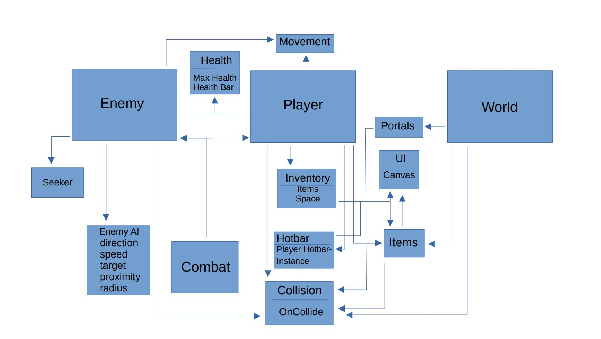

<h1>Architecture Diagram</h1>

<h3>Description</h3>
The first collection of objects is the enemy object. We modularized it in the following way:
First, our enemy is connected with two main components: the seeker and enemy AI scripts.
Next, We connected it to the combat, healthbar, movement, and collision scripts.
These are also connected to the player collection of objects in order to promote
code reuse and save us some time.

As for the player collection of objects, we modularized it in the following way: 
First, our inventory related scripts and objects directly interact with the player object, and provide an effective interface 
between UI and collectable world items like weapons and potions. We chose this specific implementation because it prevents 
the tweaking of variables that may have multiple uses within a single player object. For example, we can easily change the space 
variable in our Inventory scripts without messing something up in our player object.
Next, our combat and collision related scripts and objects are also separated and modularized from our main player object. 
Similarly, this is to promote an organized programming environment where individual pieces can be modified with a more predicable outcome.

Finally, our world collection of objects was connected in the following way:
The world objects were connected to portals, items, and collision. From here, these
connected items were linked to the UI in order to display on the screen. 