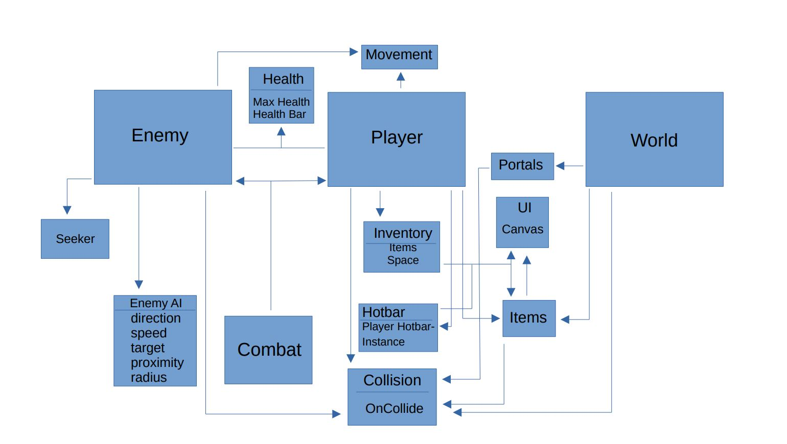

<h1>Architecture Diagram</h1>

<h3>Description</h3>
The first collection of objects is the enemy object. We modularized it in the following way:
First, our enemy is connected with two main components: the seeker and enemy AI scripts.
Next, We connected it to the combat, healthbar, movement, and collision scripts.
These are also connected to the player collection of objects in order to promote
code reuse and save us some time.

As for the player collection of objects, we modularized it in the following way: 
First, our inventory related scripts and objects directly interact with the player object, and provide an effective interface 
between UI and collectable world items like weapons and potions. We chose this specific implementation because it prevents 
the tweaking of variables that may have multiple uses within a single player object. For example, we can easily change the space 
variable in our Inventory scripts without messing something up in our player object.
Next, our combat and collision related scripts and objects are also separated and modularized from our main player object. 
Similarly, this is to promote an organized programming environment where individual pieces can be modified with a more predicable outcome.

Finally, our world collection of objects was connected in the following way:
The world objects were connected to portals, items, and collision. From here, these
connected items were linked to the UI in order to display on the screen. 

<h1>Class Level Design</h1>
Our major classes are broken down into the main areas you see in the Architecture Diagram.

<h3>Enemy Classes</h3>
Our main classes here are EnemyAI and EnemyBehaviour. These classes control everything to do with the enemies in our game.
EnemyAI controls the pathfinding component of enemies, including direction, speed, target, proximity, and radius.
EnemyBehaviour controls the finer details of our enemies. This includes health, collision, and item drops. 

There are more minor classes for our enemy system, but they are more supporting. For example, we have a class which controls the healthbar of each individual
enemy, which is controlled by the more substansive EnemyBehaviour script.

<h3>Player Classes</h3>
Our main classes in Player are: Inventory(both hotbar and main inventory), PlayerCombat, Player, and Health.
Our Inventory related classes are Inventory and Hotbar. Inventory handles the main inventory, including logic for adding/removing items, and the UI.
The Hotbar is very similar. It handles the logic for items in the inventory, and also handles the UI for the hotbar itself.
The PlayerCombat class is what handles the combat aspect of the game. It includes a target for hitting enemies, damage, etc...
The Player class is one of the most substansive classes in the entire project. In handles a multitude of tasks. These include movement logic, gfx handling (mirroring depending on movement direction),
hitbox, health, and some inventory related code. 
The Health class is what keeps track of the player health, and also controls the game logic for the player dying. Furthermore, it helps control the healthbar that we have installed in the canvas UI.

<h3>World Classes</h3>
Our World related classes are what keep the game flowing and allows for a good gameplay loop.
The major classes in this set are Items (healthPot, sword01, etc...), Portal, and GameManager.
The Items "class" is really a set of classes. Each item in our game like health potions, swords, mana potions, etc..
each have their own class to handle the logic for picking up and dropping the items. They also handle the animation or each item, preventing the 
dropped item from being static.
The Portal class is what handles the loading of dungeons and other world areas. For example, when you hit certain areas of the map,
it will load in (additively) the specific scene that is appropriate for that portal. The specifics of loading in a scene are actually handled by
the GameManager.
The GameManager class is exactly what I described earlier. It handles large-scale gameplay logic such as switching levels and scene management. 

We have plenty more minor classes than the ones listed and described above. However, they all tie into the major classes I talked about above. 
The minor ones all aid the larger classes, so by describing the ones above, you should have a good idea what the major component classes of our project include.

<h1>Control Requirments</h1>
The main external control requirments for our project is the keyboard. We are implementing a game, so our program needs to be able to take some level of keyboard input
in order to control the player character for combat and general gameplay. This in turn will control how and in what order the program loads in certain levels and quests.
The main way we can interface with the keyboard is through built in methods within the unity game engine. We are able to map buttons and actions to keybinds, which the player
can then set to their own comfort.
