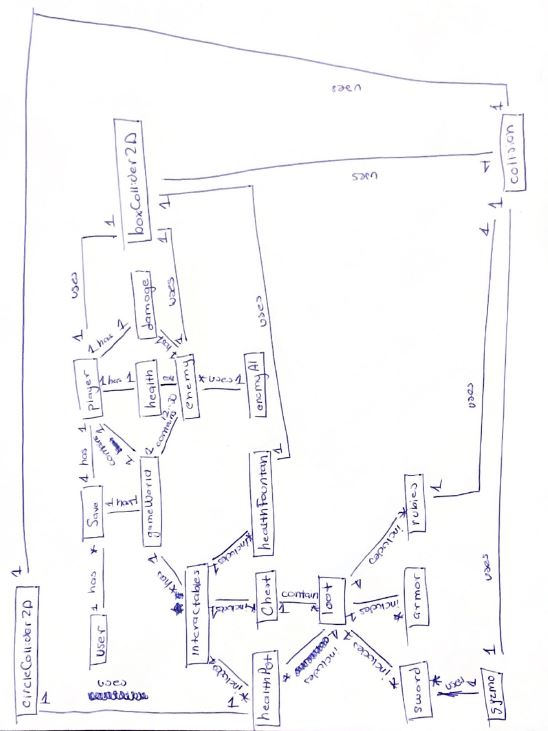

Requirements Specification for Everblade

<h3>1. Introduction</h3>

<h4>1.1 Purpose of Product</h4>

The purpose of our product is to deliver a fun experience for the user. Since our product is a small video game,
this means that the user should be able to enjoy themselves while they are playing. We plan on having a 
target audience of individuals who like roleplaying games, so we aim to have a fun dungeon crawling experience.
You will be able to fight your way to loot, and progress to the games ending in an enjoyable manner.

<h4>1.2 Scope of Product</h4>

The scope of our game is to have the basic elements you would expect to see in any RPG. This includes a dungeon crawling experience,
monster fighting, and character progression. For the dungeon crawling, you can expect to fight a variety of monsters while 
looting dungeons. For the monster fighting, the player will be able to slay monsters with a variety of weapons that are rewarding to use.
For the character progressioin, you will be able to use the loot and exerience from dungeon crawling to upgrade weapons and your character.
To upgrade your character, you will be able to get better armour and and more health.

<h4>1.3 Acronyms, Abbreviations, Definitions</h4>
These requirements are written in a consise manner, but does not use acronyms, abbreviatons, or definitions that need to be written here.

<h4>1.4 References</h4>
N/A

<h3>2. General Description of Product</h3>

Our project will be a 2D top down role playing game, rpg for short.  We decided to use the unity engine. Now, If you’ve ever played the original legend of zelda, you already have an idea of what our game is 
going to look like. If you haven’t seen that game then just imagine a little sticker on your table that moves around. Like Legend of Zelda, our video game will be set in a high fantasy world. 
So if you’ve ever played dungeons and dragons or even skyrim, some of the elements in those games will be found in ours. For example, we’ll have dwarves and goblins. 
We’re going for a more lighthearted theme.

<h4>2.1 Context of Product</h4>

The product will be used in an entertainment environment. We will release the game for PC only.

<h4>2.2 Domain Model with Description</h4>

<h5>User: interacts with the following</h5>

- game world

----------------------------------------------------------------------------------------------------

<h5>Game World: Contains the following </h5>

- player character, user will predominately control this with certain input
- enemies, will act on their own within certain parameters
- intractables, will have certain behaviors that can be exploited by users/player character

----------------------------------------------------------------------------------------------------

<h5>Player Character: contained by gameWorld, will use, and have the following</h5>

<b>(Use)</b>

- boxCollider 2D, this allows the player character to interact with the world and not pass through 
  what should not be passed through 

<b>(Have)</b>

- damage, allows the player to "disable" enemies 
- health, determines when the player has to respawn
- user, will control player character 

----------------------------------------------------------------------------------------------------

<h5>Enemy: contained by gameWorld, Will use, and have the following </h5>

<b>(Use)</b>

- Enemy Artificial Intelligence (AI), this will allow enemies to act in specific ways that are
  dependent on the player 

- boxCollider 2D, this allows the enemy character to interact with the world and player as well as
  not pass through what should not be passed through 

<b>(Have)</b>

- damage, allows the enemies to "disable" player Character 
- health, determines when the enemy has to be disabled

----------------------------------------------------------------------------------------------------

<h5>Interactables: contained by gameWorld, intractable by player, will include the following</h5>

- healthPot, allows player to replenish health points
- chest, will contain loot that can be used by player 
- healthFountain, allows player to replenish health points

----------------------------------------------------------------------------------------------------

<h5>Box/Circle Collider 2D: uses and is used by the following </h5>

<b>(Used)</b>

- interactables
- player 
- enemies

<b>(Uses)</b>

- collision, this allows anything that used colliders to not be able to pass through certain things
  And trigger certain events 

<h4>2.3 Product Functions (general)</h4>

Our product will be a 2D roleplaying game. Some basic capabilities from our product include: Some dialogue, 2 separate and entertaining worlds (dungeons and overworld),
dungeon crawling, looting, fighting (melee mainly), some magic, character progression, and quests to follow. The exact extent of each of these listed
capabilities depend on the time it will take to develop each one, but each should be available to some extent.

<h4>2.4 User Characteristics and Expectations</h4>

The typical user for our system will be fairly new and returning RPG gamers. They should be somewhat familiar with how a computer works (keyboard, mouse, etc...) and should
also have some experience with typical game design. This means they should understand that most games use WASD to move, and have an idea about
what is to be expected from an RPG. 

<h4>2.5 Constraints</h4>

The biggest constraint on our system is our lack of experience and technical knowledge with UNITY and the short timeframe we have to develop such 
an expansive game. 

<h4>2.6 Assumptions and Dependencies</h4>

Our system should be packaged as an .EXE when we are finished, so there shouldn't be an external dependencies.

<h3>3. Functional Requirements</h3>

Here is a link to our User Stories page. This will give you a good idea of our functional requirements.
https://inlaiddata.github.io/Pages/userstories.html

<h3>4. System and Non-functional Requirements</h3>

<h4>4.1 External Interface Requirements (User,Hardware,Software,Communications)</h4>

<b>NF.4.1.1 User</b>
The user of our product should be familiar with how to use a computer (Keyboard, mouse, etc...) and should have a
basic knowledge of video games. Furthermore, our user should be familiar with the standards of RPG's, such as 
questing, combat, and movement.

<b>NF.4.1.2 Hardware</b>
An external interface for our product will be the keyboard, mouse, and moniter. These external peripherals are for
the direct control of our game.

<b>NF.4.1.3 Software</b>
Our product should have no external software requirments.

<b>NF.4.1.4 Communications</b>
Our product should have no external communications requirements.

<h4>4.2 Performance Requirements</h4>

<b>NF.4.2.1 Framerate</b>
Our product should perform at a comfortable framerate (30FPS or above) in order to be an enjoyable experience.

<b>NF.4.2.2 Ease of use</b>
Our product should be easy to learn and uncomplicated (For intented users).

<h4>4.3 Design Constraints</h4>

The biggest design constraints we will have are both time and technical knowledge.

<b>NF.4.3.1 Time</b>
Time is by far the largest design constraint. We have a short time to make an expansive game.

<b>NF.4.3.2 Technical knowledge</b>
Because of our limited experience with Unity and game design, we are learning and creating at the same time.
This slows things down.

<h4>4.4 Quality Requirements</h4>
The main quality requirments for our product is an enjoyable experience and ease of use.

<b>NF.4.4.1 Enjoyable experience</b>
Our product must be enjoyable for the target audience. This means it must have the things present in your typical RPG.

<b>NF.4.4.2 Ease of use</b>
Our product must be easy to learn and to use for our target user. This means no complicated controls or gamplay mechanics.

<h4>4.5 Other Requirements</h4>
The only other requirment is that our project be of a managable size. With such a large scope, it may be nesessary to tone some features down.

<h3>5. Appendices</h3>
N/A